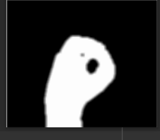

# Indian-Sign-Language-Digit-Recognition

**[Updating Repo . . . . .]**

A real time hand-gesture to text conversion using OpenCV.

# Table of Contents

1. [Motivation](#motivation)  
2. [Description](#description)  
3. [Methodology](#methodology)
4. [Getting Started](#getting-started)

 
# Motivation
Sign language is the only mode of communication for the voice and hearing impaired. People often find it hard to understand sign language and interpret the meaning of the same. Thus, there is a need for a Human Computer Interaction (HCI) system that performs this task of conversion of real time hand gestures into text. This project aims at developing such a system to detect digits from 0 to 5 based on Indian Sign Language. 

# Description
Sign language is categorized in accordance to regions like Indian, American, Chinese, Arabic and so on and researches on hand gesture recognition, pattern recognitions, image processing have been carried by countries to improve the applications and bring them to the best levels. The project is implemented in Python and OpenCV library functions for image processing. A webcam is used to record the real-time live video of the person performing the various gestures and the output text along with the video is displayed on a screen. 

# Methodology
The project implementation can be divided into 3 major steps.

## 1. Data Preprocessing

A region of reference with a rectangular boundary is created as shown in the figure. 

The user is required to place his hand inside this region as the further processing is applied only to this frame of reference. The frame is first converted from BGR to HSV color range. The HSV values are ajusted such that only the hand skin color is detected as shwon below. 

Next, a B/W mask is created for the hand as shwon below.

Finally, the frame is enhanced further to remove sharp edges and other discontinuties using the process of "Dialation" and "Smoothening". 

## 2. Feature Extraction

Certain mathematical functions are applied on the so obtained masked image in order to classify them into different classes from 0-5 digits. Firstly, a contour is drawn on the image of the palm (drawn in blue in the below image).   

Next, a convex hull is drawn around the hand. It simply connects all the outermost points of the masked images and is shown in red color in the image below..  

A function is used to obtain the coordinates of the end points of each of the defect present between ie., the defect between 2 fingers. The farthest point is calculated by the Euler’s formula. Using this, by cosine rule we find the angle between each of the defects and the contours. The angles are as shown in the image below as black lines. 

## 3. Real time classification/Algorithm

The classification happens based on the features extracted. The algorithm works as follows:
-	The angles thus calculated will be given a range within which it is classified as a defect and is indicated with a blue dot.
-	Each time an angle falls in this range, a counter is incremented by 1.
-	The final counter is incremented by 1 as the gesture made is 1+counter value.
-	The output is then displayed as a readable text on the top of the real time video frame.   
The above algorithm fails to identify the gestures for digit ‘0’ and ‘1’ since both have no defects in them. To overcome this issue, we extract additional features like the ratio of area between the contour and hull to that of contour. i.e.//

Area ratio = (Area of hull – Area of contour) / (Area of contour)//
  
We see that this ratio is essentially greater for the gesture ‘1’ than for that of the gesture ‘0’. Thus, by assigning a threshold we are able to classify the gesture correctly as shown.  
//
Some of the final results are as shown below.

# Getting Started
### Software and Library Installation
- Python for coding.
- OpenCV library to apply image processing techniques.

### Steps to follow
1. Execute code.py file.
2. Adjust the HSV parameters to detect the hand in the ROI.
3. Make ISL hand signs and observe the textual output displayed.
